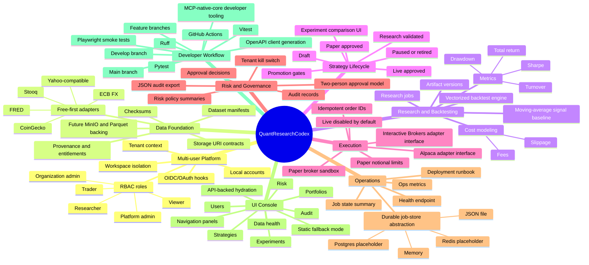
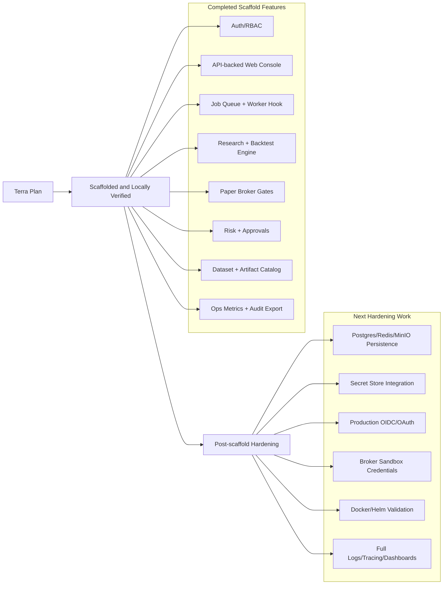

# Feature Map Diagram

This map groups the platform features by operator workflow and implementation area.

```mermaid
mindmap
  root((QuantResearchCodex))
    Multi-user Platform
      Local accounts
      OIDC/OAuth hooks
      Tenant context
      Workspace isolation
      RBAC roles
        Platform admin
        Organization admin
        Researcher
        Trader
        Viewer
    Data Foundation
      Free-first adapters
        Stooq
        CoinGecko
        ECB FX
        FRED
        Yahoo-compatible
      Dataset manifests
      Provenance and entitlements
      Checksums
      Storage URI contracts
      Future MinIO and Parquet backing
    Research and Backtesting
      Research jobs
      Moving-average signal baseline
      Vectorized backtest engine
      Cost modeling
        Fees
        Slippage
      Metrics
        Total return
        Sharpe
        Drawdown
        Turnover
      Artifact versions
    Strategy Lifecycle
      Draft
      Research validated
      Paper approved
      Live approved
      Paused or retired
      Promotion gates
      Experiment comparison UI
    Execution
      Paper broker sandbox
      Alpaca adapter interface
      Interactive Brokers adapter interface
      Idempotent order IDs
      Paper notional limits
      Live disabled by default
    Risk and Governance
      Tenant kill switch
      Risk policy summaries
      Two-person approval model
      Approval decisions
      Audit records
      JSON audit export
    Operations
      Health endpoint
      Ops metrics
      Job state summary
      Durable job-store abstraction
        Memory
        JSON file
        Redis placeholder
        Postgres placeholder
      Deployment runbook
    UI Console
      Navigation panels
      Data health
      Experiments
      Strategies
      Portfolios
      Risk
      Audit
      Users
      Static fallback mode
      API-backed hydration
    Developer Workflow
      Feature branches
      Develop branch
      Main branch
      Pytest
      Ruff
      Vitest
      Playwright smoke tests
      OpenAPI client generation
      GitHub Actions
      MCP-native-core developer tooling
```

## Current Feature Status

```mermaid
flowchart LR
  Planned["Terra Plan"] --> Scaffolded["Scaffolded and Locally Verified"]
  Scaffolded --> Hardening["Post-scaffold Hardening"]

  subgraph ScaffoldedFeatures["Completed Scaffold Features"]
    Auth["Auth/RBAC"]
    Console["API-backed Web Console"]
    Jobs["Job Queue + Worker Hook"]
    Research["Research + Backtest Engine"]
    Paper["Paper Broker Gates"]
    Risk["Risk + Approvals"]
    Catalog["Dataset + Artifact Catalog"]
    Ops["Ops Metrics + Audit Export"]
  end

  subgraph HardeningFeatures["Next Hardening Work"]
    Persistence["Postgres/Redis/MinIO Persistence"]
    Secrets["Secret Store Integration"]
    SSO["Production OIDC/OAuth"]
    BrokerCreds["Broker Sandbox Credentials"]
    Compose["Docker/Helm Validation"]
    Observability["Full Logs/Tracing/Dashboards"]
  end

  Scaffolded --> Auth
  Scaffolded --> Console
  Scaffolded --> Jobs
  Scaffolded --> Research
  Scaffolded --> Paper
  Scaffolded --> Risk
  Scaffolded --> Catalog
  Scaffolded --> Ops

  Hardening --> Persistence
  Hardening --> Secrets
  Hardening --> SSO
  Hardening --> BrokerCreds
  Hardening --> Compose
  Hardening --> Observability
```
