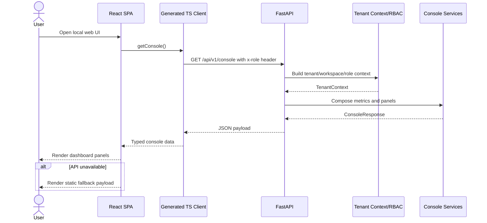
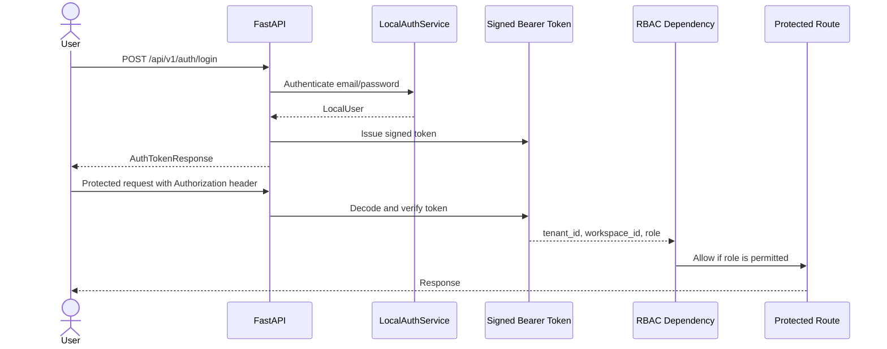
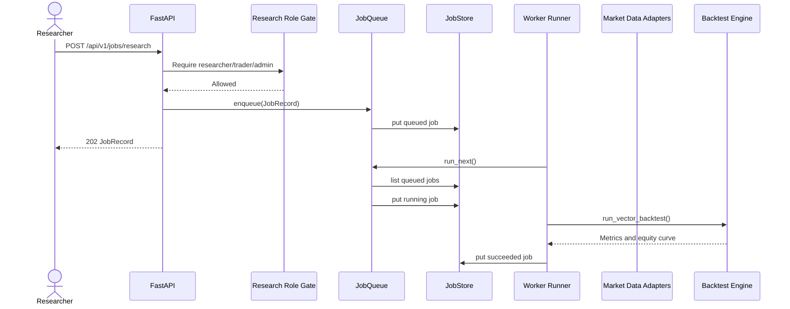
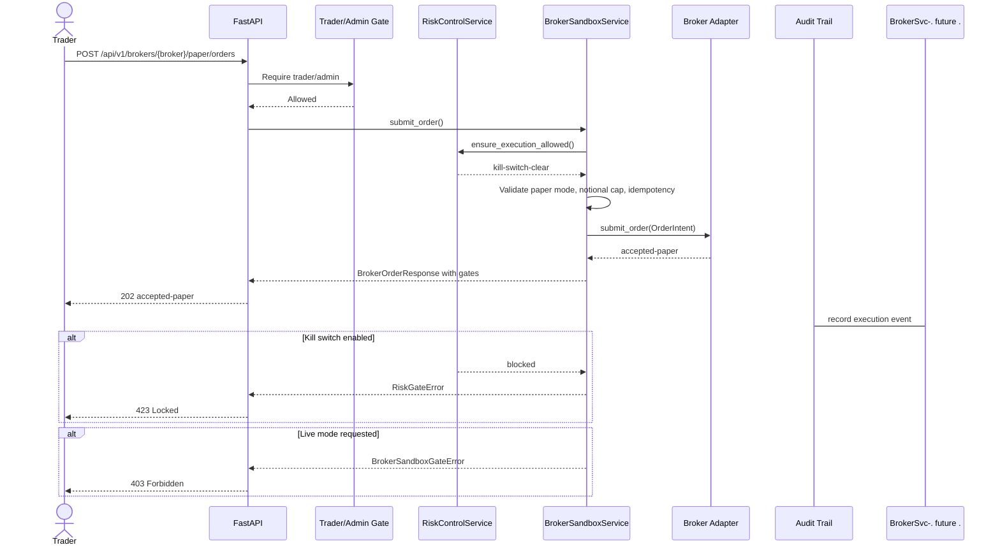
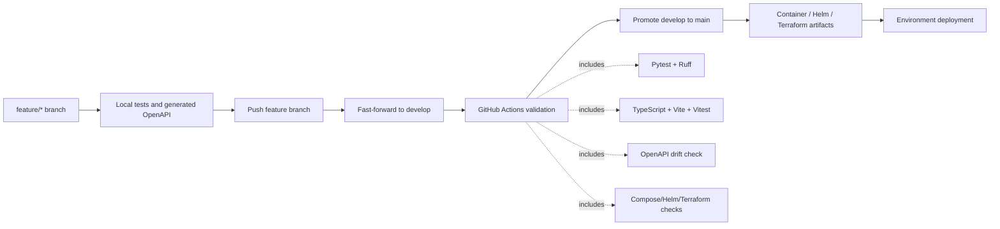

# Request Flow Diagram

This document shows how common requests move through the current system.

## UI Console Hydration

## Authenticated API Request

## Research Job Flow

## Paper Order Flow

## Deployment Flow

