# System Architecture Diagram

This diagram shows the current scaffold architecture and the intended production backing services.

```mermaid
flowchart TB
  subgraph Users["Users and Operators"]
    Admin["Platform Admin"]
    OrgAdmin["Organization Admin"]
    Researcher["Researcher"]
    Trader["Trader"]
    Viewer["Viewer"]
  end

  subgraph Web["apps/web - React + Vite SPA"]
    Console["Operator Console"]
    GeneratedClient["Generated TypeScript Client"]
    StaticFallback["Static Fallback Payload"]
  end

  subgraph API["apps/api - FastAPI"]
    Health["Health and Ops Metrics"]
    Auth["Local Auth + OIDC/OAuth Hooks"]
    RBAC["Tenant Context + RBAC"]
    Workspace["Workspace and Identity APIs"]
    DataCatalog["Data Catalog + Dataset Manifests"]
    Jobs["Job Queue + Worker Coordination"]
    Research["Research Runs + Vector Backtests"]
    Catalog["Artifact Version Catalog"]
    Brokers["Paper Broker Sandbox"]
    Risk["Risk Policies + Kill Switch + Approvals"]
    Audit["Append-only Audit Records + Export"]
    OpenAPI["OpenAPI Schema"]
  end

  subgraph Core["packages/quant_core"]
    Contracts["Domain Contracts"]
    Instruments["Instruments + Lifecycle Types"]
    BacktestEngine["Vector Backtest Engine"]
  end

  subgraph Adapters["packages/quant_adapters"]
    MarketData["Free-first Market Data Adapters"]
    BrokerAdapters["Alpaca + IBKR Broker Interfaces"]
  end

  subgraph DevInfra["Developer and CI Tooling"]
    Tests["Pytest, Ruff, Vitest, Playwright"]
    Drift["OpenAPI Drift Check"]
    MCP["MCP-native-core Developer Tooling"]
    Actions["GitHub Actions"]
  end

  subgraph Runtime["Runtime Infrastructure"]
    Postgres["PostgreSQL Metadata and Ledger"]
    Redis["Redis Queue Coordination"]
    MinIO["MinIO / S3 Object Store"]
    Docker["Docker Compose"]
    Helm["Helm Charts"]
    Terraform["Azure-first Terraform"]
  end

  Admin --> Console
  OrgAdmin --> Console
  Researcher --> Console
  Trader --> Console
  Viewer --> Console

  Console --> GeneratedClient
  Console --> StaticFallback
  GeneratedClient --> API

  API --> Auth
  Auth --> RBAC
  RBAC --> Workspace
  RBAC --> DataCatalog
  RBAC --> Jobs
  RBAC --> Research
  RBAC --> Catalog
  RBAC --> Brokers
  RBAC --> Risk
  RBAC --> Audit
  API --> Health
  API --> OpenAPI

  DataCatalog --> MarketData
  Jobs --> MarketData
  Jobs --> Research
  Research --> BacktestEngine
  Research --> Contracts
  Catalog --> Contracts
  Brokers --> BrokerAdapters
  Brokers --> Risk
  Risk --> Audit

  API -. future durable state .-> Postgres
  Jobs -. future queue backend .-> Redis
  DataCatalog -. future artifacts .-> MinIO
  Catalog -. future artifacts .-> MinIO

  OpenAPI --> Drift
  GeneratedClient --> Drift
  Tests --> Actions
  Docker --> Actions
  Helm --> Actions
  Terraform --> Actions
  MCP --> DevInfra
```

## Notes

- Current local services use in-memory implementations plus optional JSON-file job state for fast development.
- Postgres, Redis, and MinIO are scaffolded as production-oriented backing services and still need full persistence wiring.
- Live trading remains disabled by default; broker execution is paper-only until approval, risk, environment, and secret-management gates are complete.
